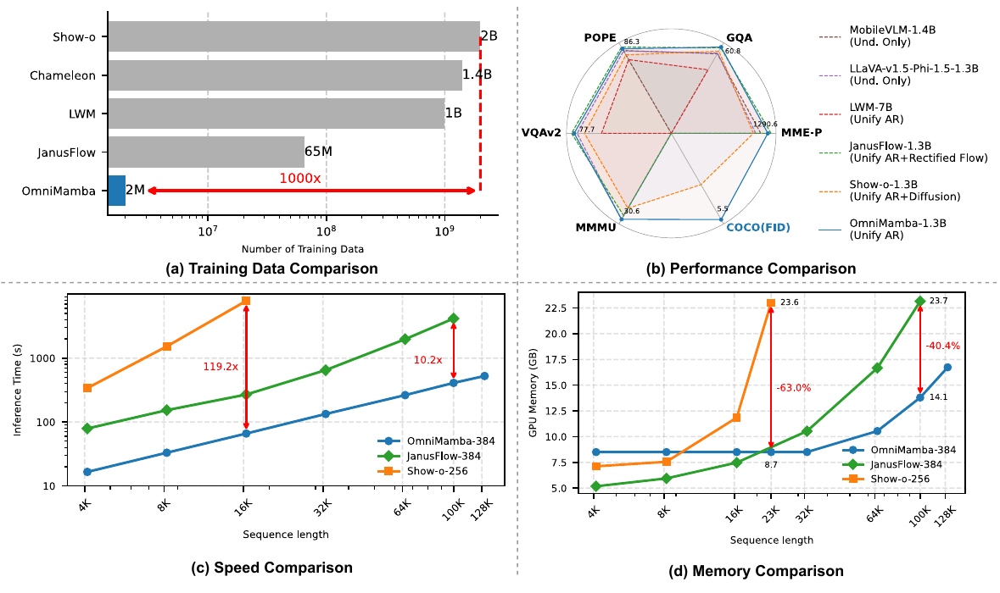
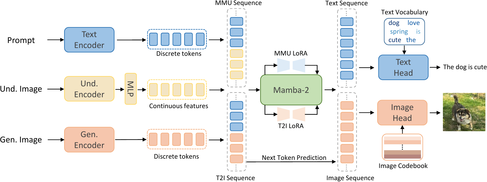
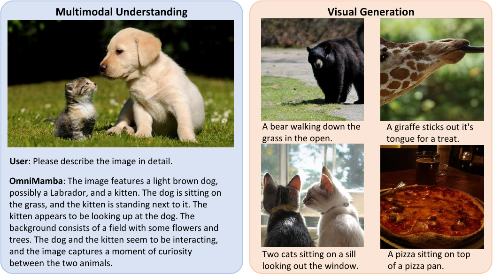

<div align ="center">
<h1>☯OmniMamba </h1>
<h3>Efficient and Unified Multimodal Understanding and Generation 
  
via State Space Models</h3>

[Jialv Zou](https://github.com/Doctor-James)<sup>1</sup>, [Bencheng Liao](https://github.com/LegendBC)<sup>2,1</sup>, [Qian Zhang](https://scholar.google.com/citations?user=pCY-bikAAAAJ&hl=zh-CN)<sup>3</sup>, [Wenyu Liu](http://eic.hust.edu.cn/professor/liuwenyu/)<sup>1</sup>, [Xinggang Wang](https://xwcv.github.io/)<sup>1,📧</sup>

<sup>1</sup>  School of EIC, HUST, <sup>2</sup>  Institute of Artificial Intelligence, HUST,   <sup>3</sup> Horizon Robotics

(<sup>📧</sup>) corresponding author.


[](https://arxiv.org/abs/xxxx)
[](https://opensource.org/licenses/Apache-2.0)

</div>

<div align="center">

</div>

## 📋 News

`[2025-3-1x]:` OmniMamba [arXiv](https://arxiv.org/abs/xxxx) paper released. Code and Weight are coming soon. Please stay tuned! ☕️

## ✨ Highlights
* To the best of our knowledge, OmniMamba is the first linear model based unified multimodal understanding and visual generation model.
* OmniMamba achieves competitive performance with only 2M data for training.
* OmniMamba is highly efficient, achieving up to a 119.2 times speedup and 63\% GPU memory reduction for long-sequence generation compared to Transformer-based counterparts.

## 🛠️ Architecture

</div>

<div align="center">

</div>

## 📊 Qualitative Results


<div align="center">

</div>

## 📚 Citation
If you find OmniMamba useful in your research or applications, please consider giving us a star &#127775; and citing it by the following BibTeX entry.


```bibtex
@article{zou2025omnimamba,
      title={OmniMamba: Efficient and Unified Multimodal Understanding and Generation via State Space Models}, 
      author={Jialv Zou and Bencheng Liao and Qian Zhang and Wenyu Liu and Xinggang Wang},
      year={2025},
      eprint={xxxx},
      archivePrefix={arXiv},
      primaryClass={cs.CV},
      url={https://arxiv.org/abs/xxxx}, 
}
```
